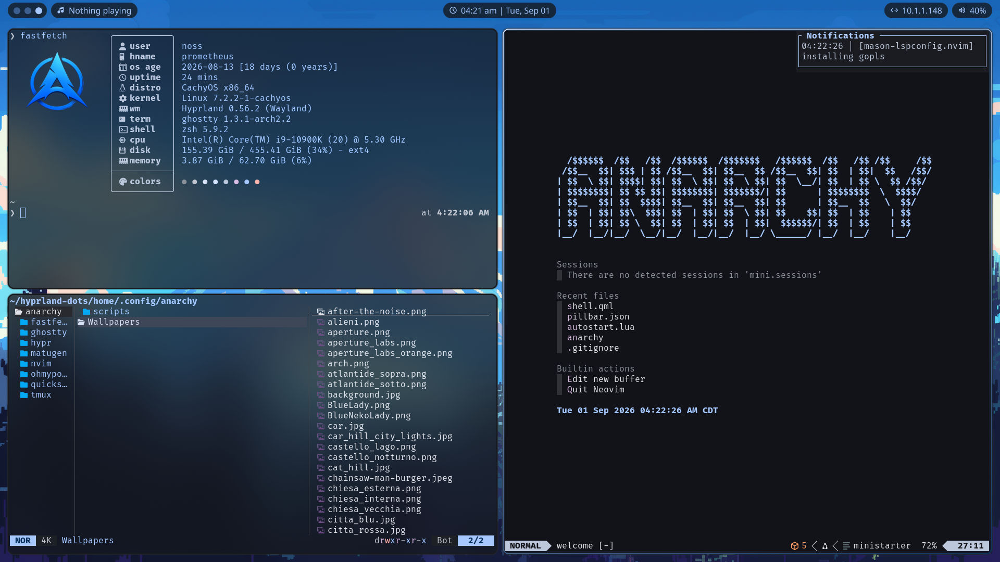
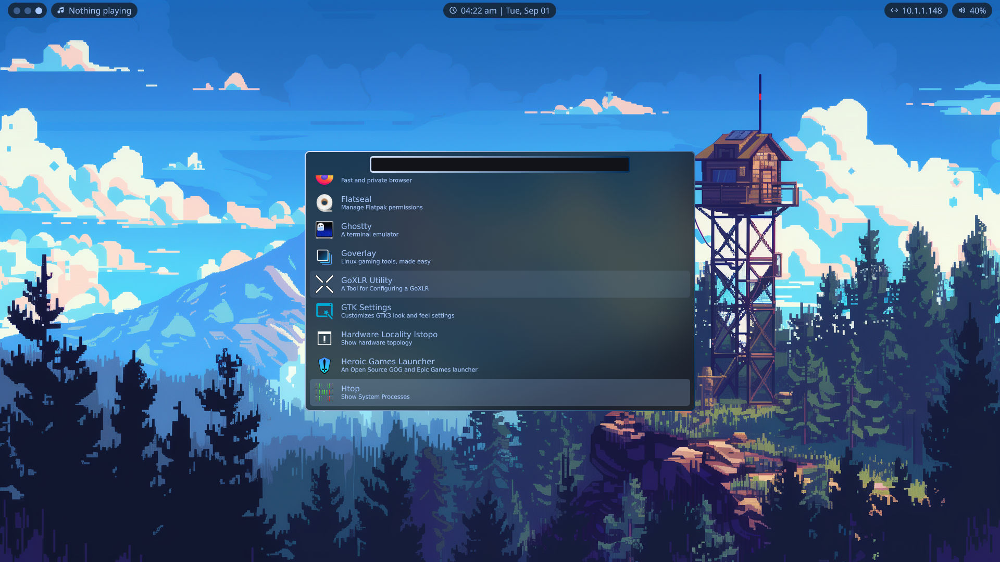
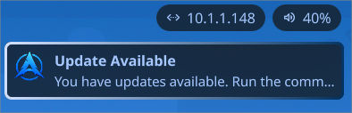
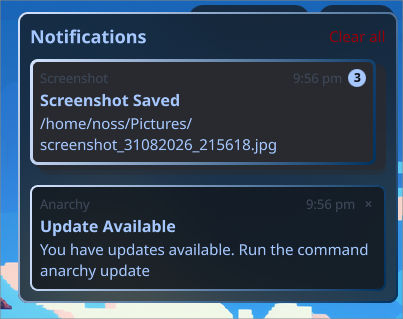
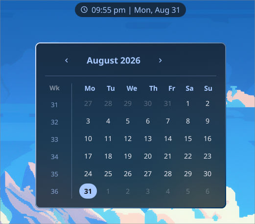

# Anarchy Dots

Welcome to Anarchy Dots, this is my custom Hyprland dotfiles that I've tried to tailor to my needs especially being modular enough that I can deploy it to any of the devices/vms that I need. You're free to use these dotfiles in any way you need, open Github issues for any feature requests/issues you may have, however, please keep in mind that I don't have any intention of being a dotfiles maintainer so any changes that are requested may or may not get implemented depending on how it effects my needs as this is mainly intended to be my dotfiles. You think if Omarchy can be called a distro, I can call this a distro too?



### Features
    - Ready built neovim config
    - Easy installation
    - Update system
    - Material themes based on your wallpapers
    - Neovim and Tmux integration
    - Quickshell for custom applications
    - True keyboard first design

<details>
    <summary>Application Selector</summary>
    
    You can access the application launcher by pressing "Super+D", search for the application you want by using "/" and navigate the list with j (down) k (up) and enter (select)

    
    
</details>

<details>
    <summary>Hyprland Keybind Cheatsheet</summary>
    
    You can access the cheatsheet by pressing "Super+Alt+K", search for the keybinds you want by using "/" and navigate the list with j (down) and k (up). All these keybinds are for hyprland specifically

    
    
</details>

<details>
    <summary>Multiple bars</summary>
    
    There are two bars to choose from with quickshell that can be chosen by navigating to "~/.config/quicksell/shell.qml" and change "import Pillbar" to "inport Fullbar"

    
    
    
</details>

<details>
    <summary>Notifications</summary>
    
    The notification system is ran by quickshell. You can access the notification center by pressing "Super+N", pressing "a" will clear all notifications. Navigate using j (down) and k (up). Clear individual notifications by hovering it and pressing "c". Expand notification groups with enter.

    
    
    
</details>

<details>
    <summary>Calendar App</summary>
    
    The calendar app is a quickshell app that was definitely not ~~stolen~~ _borrowed_ from [ML4W](https://github.com/mylinuxforwork/dotfiles) and can be accessed by either "Super+CTRL+C" or by clicking the date/time at the top
    
    
    
</details>

## Installation Steps
I've made the installation steps as easy as I can so I can deploy my dotfiles to any computer that I need to easily.

1. Download install.sh file

```bash
wget https://raw.githubusercontent.com/NotNoss/Anarchy-Dots/refs/heads/main/install.sh
```

2. It's best practice to read bash files instead of blindly running them

```bash
cat ./install.sh
```

3. Make bash script executable

```bash
chmod +x ./install.sh
```

4. Run install script (do not run with sudo)

```bash
./install.sh
```

Keep an eye on the install as anytime escalated priviledges are needed, you will be asked for your password. I prefer this to running the script with sudo that way sudo is only used as needed. 

**Note:** There are a few aur packages that are included in this install, however, I try to keep my use of aur as light as possible. All packages included in the install at the time of writing this have been manually reviewed by me, however, by running this installer, you accept the risks that come with using these packages, maybe in the future I'll add a flag to the install script to skip these packages.

## Shoutouts
When I recently came back to Hyprland, I didn't want to re-create my config as my last time using it was before the lua update so I started using [ML4W](https://github.com/mylinuxforwork/dotfiles). I ended up wanting more control and created my own but there were a few things I liked that [ML4W](https://github.com/mylinuxforwork/dotfiles) did so I used that to help me make my dots so thank you to the creator to [ML4W](https://github.com/mylinuxforwork/dotfiles).
